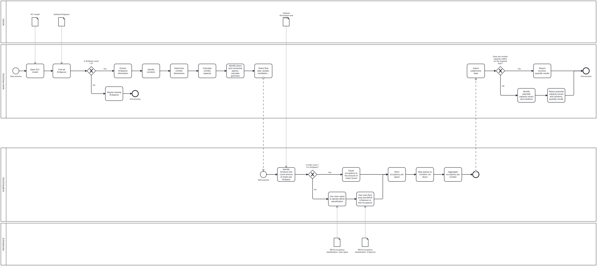

# A2 – IFC Corridor Flow Capacity Check: Building 2608

## A2a – About Our Group

**Group members:** Yasmin Ayad Hussein Al-Seelawi, Albert Manzanares Fernández, Yarne Lambrechts

**Group Python coding confidence score:** Combined score of 9/12

**Group focus area:** Architecture.

**Group role:** Analysts

---

## A2b – Identify Claim

**Selected building report:** Building #2608

**Claim to check:** Whether the corridors in Building 2608 have sufficient flow capacity for the expected occupancy of the connected spaces. (Later on this could be expanded to other flow capacties such as ventilation.)

**Description of the claim**

This project investigates corridor flow capacity using information extracted from the building's IFC model. The tool will identify spaces and corridors, estimate the number of occupants in relevant spaces, determine how those spaces connect to corridors, and prepare the information required to check corridor flow capacity against the applicable criteria in Report 2608.

**Justification**

Corridors connect different areas of a building and may be important routes for occupant movement. Assessing their flow capacity can help identify potential bottlenecks and support design decisions.

Using IFC data provides a repeatable way to extract spatial information and reduces the need for manual inspection. The check also provides an opportunity to explore how BIM data can be used to evaluate a specific claim made in a building report.

The exact claim and acceptance criteria will be confirmed against Report 2608.

---

## A2c – Use Case

### How will the claim be checked?

The proposed use case is an IFC-based corridor flow-capacity check.

1. Load the IFC building model using IfcOpenShell.
2. Check whether `IfcSpace` entities are available.
3. Extract the relevant spatial information and geometry.
4. Identify corridors and obtain their relevant dimensions.
5. Estimate the occupancy of individual spaces.
6. Identify connections between spaces and corridors using available door and spatial relationship information.
7. Aggregate the relevant occupancy for each corridor according to the selected flow assumptions.
8. Compare the required information with the applicable corridor flow-capacity criteria from Report 2608.
9. Produce a report containing the extracted data, assumptions, and check results.

### When should the claim be checked?

The check is intended primarily for the design phase, when potential corridor capacity issues can still inform design decisions. It may also be used to assess an existing building if a suitable IFC model is available.

### What information does the claim rely on?

The check may require:

- Space identities, functions, and floor areas.
- Corridor geometry and dimensions.
- Furniture information for chair-count-based occupancy estimation.
- Door locations and relationships between spaces.
- BR18: Applicable occupancy-density values.
- The relevant corridor flow-capacity criteria from Report 2608.

### Phase

**Primary phase:** Design.

**Potential additional phase:** Operation, for checking an existing building model.

### BIM purpose

The main BIM purposes are:

- **Gather:** Extract relevant information from the IFC model.
- **Analyse:** Estimate occupancy and evaluate corridor flow capacity.
- **Communicate:** Present results and potential issues to designers or other stakeholders.

### Related BIM use case

The use cases that could be used as references are: 2408, 2502, 2504, 2513. Each one has elements that could form the entire flow of the flow capacity tool.

### Whole use case BPMN diagram

The whole-use-case BPMN diagram should show the process from selecting the building and providing the IFC model through extracting information, estimating occupancy, identifying corridor connections, checking flow capacity, and communicating the results.



[Open the whole-use-case SVG](IMG/ARCH06_A2.svg)

[Open the whole-use-case BPMN file](IMG/ARCH06_02.bpmn)

---

## A2d – Scope the Use Case

The new tool is scoped to the part of the whole use case that automates the extraction and processing of IFC information for the people-flow occupancy and corridor flow-capacity check.

### Tool scope

The intended scope includes:

- Reading `IfcSpace` entities and relevant geometry or properties.
- Identifying furniture represented by `IfcFurniture`.
- Counting chairs per space where they can be identified.
- Estimating occupancy using a fallback method when chairs are not identified, provided the required area, space-function, and occupancy-density information is available.
- Identifying corridor connections using `IfcDoor` and available spatial relationships.
- Aggregating occupancy information for relevant corridors.
- Preparing data for comparison with the criteria from Report 2608.

### Outside the current scope

Ventilation-flow analysis is not part of the current people-flow implementation. Other advanced analyses are also outside the scope unless added later.

---

## A2e – Tool Idea

### Tool description

The proposed tool is a Python application using IfcOpenShell to extract relevant building information from an IFC model and support corridor flow-capacity checking.

The tool estimates people occupancy by counting identifiable chairs in each space. If no chairs are found, a BR18 fallback based on floor area and an applicable occupancy density may be used. It then uses available door and spatial relationship information to associate spaces with corridors and aggregate relevant occupancy.

The resulting information is intended to support a check against the design properties from Report 2608.

### Business value

- Reduces manual extraction of spatial information from IFC models.
- Makes occupancy assumptions and calculations more transparent.
- Supports repeatable model-checking workflows.
- Helps designers identify potential corridor flow-capacity issues earlier.

### Societal value

- Supports consideration of occupant movement and circulation in building design.
- Helps highlight potential bottlenecks for further investigation.
- Encourages more consistent use of digital building information in design assessment.

The tool supports the checking process; its results depend on the quality of the IFC data and the correct interpretation and implementation of the relevant criteria.

## A2f – Information Requirements

The tool depends on information from the IFC model and external reference data.

| Information required | IFC source or other source | Purpose | Availability / learning needs |
|---|---|---|---|
| Space identity and function | `IfcSpace` attributes and properties | Identify and classify spaces | Check naming and property consistency in the model |
| Space floor area | `IfcSpace` quantities, properties, or geometry | Support fallback occupancy estimation | Verify how area is represented or calculated in the model |
| Corridor geometry and dimensions | `IfcSpace` geometry and relevant properties | Support corridor identification and capacity checks | Confirm the required dimensions and units |
| Furniture identity and type | `IfcFurniture` attributes, including predefined type, name, and object type | Identify and count chairs | Check naming conventions and predefined types |
| Spatial containment | `IfcRelContainedInSpatialStructure` | Associate contained elements with spatial structures | Verify which relationships are present |
| Door information | `IfcDoor` and relevant relationships | Help establish connections between spaces and corridors | Determine how connectivity can be reliably inferred |
| Space boundaries | `IfcRelSpaceBoundary`, where available | Provide additional information about spatial relationships | Check whether boundaries are present and usable |
| Occupancy density | External reference regulatory criteria (BR18) | Estimate occupancy when chair counts are unavailable | Confirm the applicable values and their source |
| Corridor flow-capacity criteria | Report 2608 and any referenced requirements | Evaluate the corridor claim | Identify the exact criteria, calculation method, and units |

### Current implementation considerations

The Python implementation includes functions for identifying likely chairs, counting chairs per space, and applying a fallback callback when no chairs are found.

The fallback calculation must have access to the space area and an appropriate density value. A space-classification function alone does not calculate occupancy.

Connectivity also needs validation: the presence of a door does not automatically prove which spaces it connects unless the necessary relationships or geometric evidence are available.

### Learning needs

Items to investigate and, where appropriate, add to the course Learning Need Bank include:

- How to reliably obtain floor area and corridor dimensions from different IFC models.
- How to identify space functions when naming conventions vary.
- How to infer space connectivity from IFC door and boundary relationships.
- How to implement and validate the relevant Report 2608 criteria.
- How to handle missing, ambiguous, or duplicated occupancy information.

---

## A2g – Identify Appropriate Software Licence

The project uses Python and IfcOpenShell.

---

## Project Structure

The A2 folder is intended to contain the README and the BPMN/SVG deliverables:

```text
A2/
├── README.md
└── IMG/
    ├── ARCH06_A2.svg
    ├── ARCH06_A2.bpmn

```
